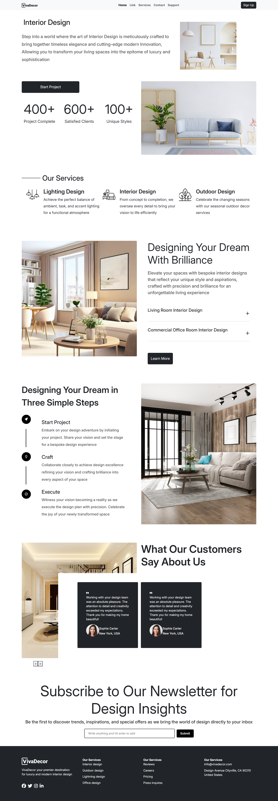
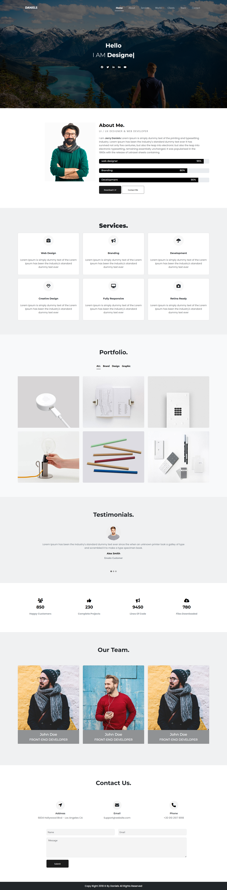
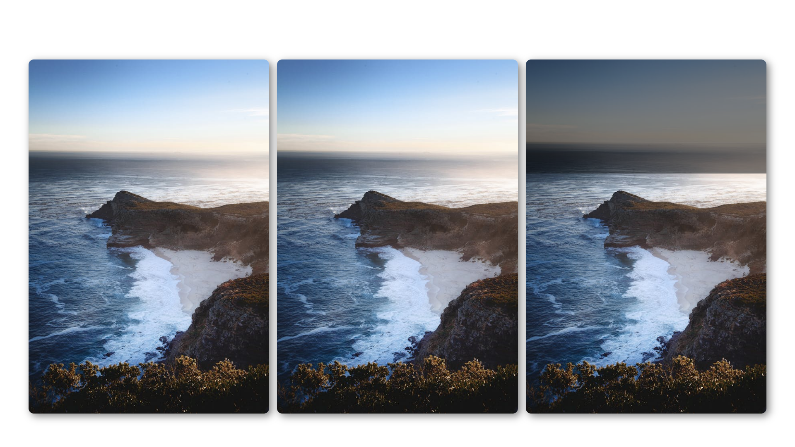
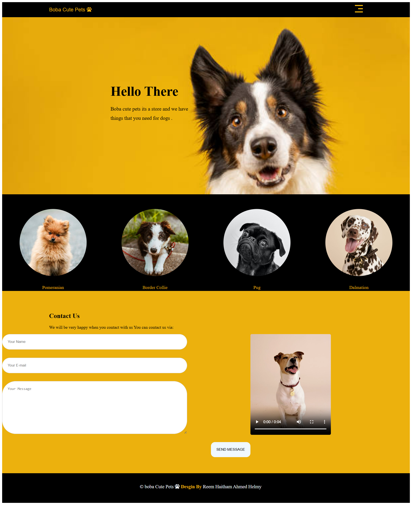
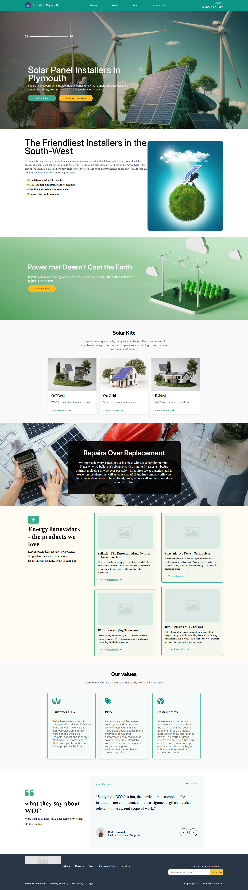

# 🌸 HTML & CSS Mini Projects  
A collection of my small front-end projects built using HTML and CSS.  
Each project focuses on layout, design, and responsiveness.

| Project | Preview | Description |
|----------|----------|--------------|
| **Viva Decor Landing Page** |  | Modern landing page for interior design. |
| **Daniels-main** |  | A simple landing page for a portfolio. |
| **Overlay Image** |  | This project demonstrates how to use CSS overlays to display text on top of images, creating a modern and elegant effect. |
| **Boba Cute Pet** |  | pets app my first project using html , css. |
| **Landing Page Solar** |  | Landing Page build in html css. |
---

## 💻 How to view  
Click on any project folder above ⬆️  
or run it locally in your browser after downloading.

---

## 🌷 Technologies Used  
- HTML5  
- CSS3  
- Responsive Design (Flexbox, Grid)
# html-css-mini-projects
Mini projects built with HTML &amp; CSS
